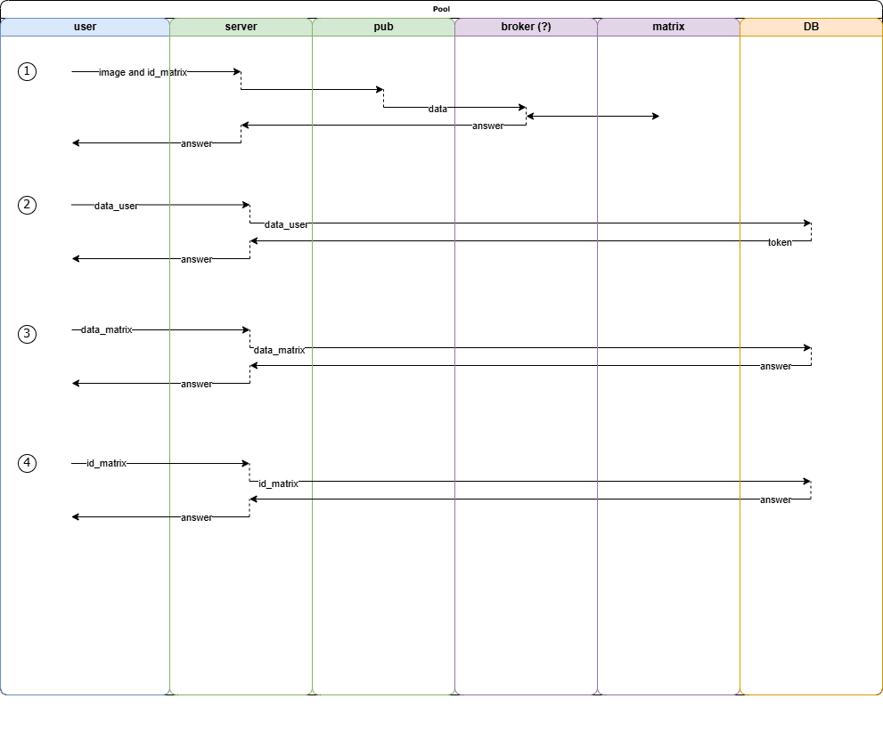

# Интерактивная система отображения данных с использованием микроконтроллера и открытого API.

## Описание проекта

В данной курсовой работе будет разработана система, которая позволяет пользователю отправлять данные через API, а затем визуализировать эти данные на светодиодной матрице (управляемой Arduino). Пользователь сможет использовать карточку или другой идентификатор для авторизации и получения информации.

## Компоненты

*  **Python API:**
    *  Серверная часть, которая принимает данные от пользователя.
*  **Arduino:**
    *  Устройство, которое будет отображать информацию на светодиодной матрице.
*  **Система аутентификации:**
    *  Использование карточки или другого метода для идентификации пользователя. `(?)`

## Принцип работы

1. Отправка данных:
    *  Пользователь отправляет данные через API (например, с помощью POST-запроса).
    *  Тип данных и наполнение пока `неизвестно`.

2. Хранение данных:
    *  Данные сохраняются на сервере (например, в базе данных или в файле).

3. Аутентификация пользователя:
    *  Пользователь приходит к устройству и использует карточку для аутентификации.
    *  При успешной аутентификации устройство запрашивает данные, связанные с пользователем.

4. Отображение данных:
    *  Arduino получает данные через последовательный порт (Serial) и отображает их на светодиодной матрице.

## Реализация проекта

1. Python
    *  Flask+CORS для создания API.
    *  Хранилище данных (база данных, MySQL или PostgreSQL) + sqlalchemy для работы с БД.
2. Arduino
    *  Библиотеки для работы со светодиодной матрицей. `(?)`
3. Аутентификация пользователя
    *  Система аутентификации. `(?)`

## Пример использования
 
На производственных предприятиях система может служить для мониторинга состояния оборудования. 
Рабочие могут использовать идентификационные карты для доступа к информации о состоянии машин, их производительности и необходимости обслуживания.

Также система может служить для идентификации рабочих.

*Пользователи (пример):* 
  - Инженеры
  - Операторы
  - Менеджеры по качеству

## Варианты выбора СУБД:

### 1. SQLite:

* Преимущества:
    * **Простая в использовании:** SQLite - это встроенная база данных, не требующая отдельного сервера.
    * **Легкая в установке:** Не нужно устанавливать дополнительное программное обеспечение.
    * **Идеальна для небольших проектов:** Подходит для хранения ограниченного количества данных.
* Недостатки:
    * **Ограниченная функциональность:** Не поддерживает некоторые продвинутые функции, доступные в других СУБД.
    * **Не подходит для масштабирования:** Не подходит для хранения больших объемов данных или для обработки большого количества запросов.

### 2. MySQL:

* Преимущества:
    * **Популярная и мощная СУБД:** Широко используется, обладает большой функциональностью.
    * **Хорошо масштабируется:** Подходит для хранения больших объемов данных и обработки большого количества запросов.
    * **Широкая поддержка:** Существует множество ресурсов и документации.
* Недостатки:
    * **Сложнее в установке и настройке:** Требует установки отдельного сервера.
    * **Может быть излишней для небольших проектов.**

### 3. PostgreSQL:

* Преимущества:
    * **Наиболее мощная СУБД:** Обладает широким спектром функций и возможностей.
    * **Высокая надежность:** Обеспечивает высокую стабильность и целостность данных.
    * **Хорошо масштабируется:** Подходит для хранения больших объемов данных и обработки большого количества запросов.
* Недостатки:
    * **Сложнее в установке и настройке:** Требует установки отдельного сервера.
    * **Может быть излишней для небольших проектов.**

### 4. MongoDB:

* Преимущества:
    * **NoSQL база данных:** Обеспечивает гибкость в структуре данных.
    * **Хорошо масштабируется:** Подходит для хранения больших объемов данных и обработки большого количества запросов.
    * **Легкая в использовании:** Обеспечивает простой и интуитивный интерфейс.
* Недостатки:
    * **Не подходит для реляционных данных:** Не поддерживает реляционные операции.
    * **Может быть сложнее в настройке:** Требует специфических знаний и опыта.

## Варианты языков программирования:

### 1.Python

* Преимущества:
    * Обширные библиотеки: Python обладает огромным набором библиотек, которые могут быть использованы для различных задач. 
    * Кроссплатформенность: Python работает на различных операционных системах, что делает его гибким выбором для разработки.
    * Быстрый цикл разработки: Python позволяет быстро создавать прототипы и разрабатывать приложения.
    * Широкое применение: Python используется для широкого спектра задач, включая веб-разработку, научные вычисления, анализ данных и машинное обучение.
* Недостатки:
    * Скорость выполнения: Python может быть медленнее, чем некоторые компилируемые языки, такие как C++ или Java, особенно при выполнении задач, требующих высокой производительности.
    * Отсутствие статической типизации: В Python нет обязательной статической типизации, что может привести к ошибкам во время выполнения.

### 2.Java

* Преимущества:
    * Более мощный язык: Подходит для больших и сложных проектов.
    * Широкое распространение: Большая база ресурсов и документации.
    * Статическая типизация: Обеспечивает лучшую проверку кода и снижение вероятности ошибок.
* Недостатки:
    * Более сложный синтаксис: Требует большего времени на разработку.
    * Требует большего времени на компиляцию: Может быть менее удобным для быстрого прототипирования.

### 3.C++

* Преимущества:
    * Высокая производительность: Прекрасно подходит для разработки системного ПО и приложений, требовательных к ресурсам.
    * Полный контроль над памятью: Обеспечивает большую гибкость и производительность.
* Недостатки:
    * Более сложный и трудоемкий в изучении и использовании: Требует большего времени на освоение и написание кода.
    * Более сложная настройка и работа с библиотеками: Требует большего времени и усилий.
